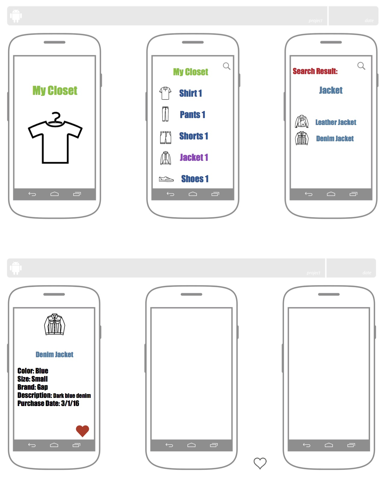
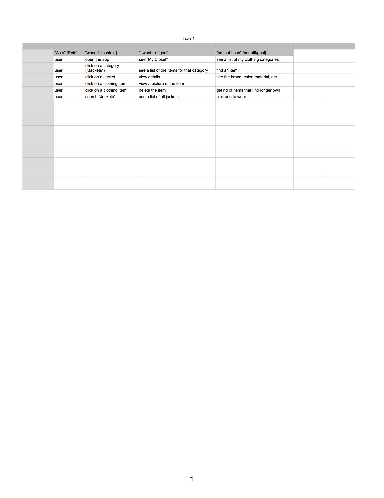
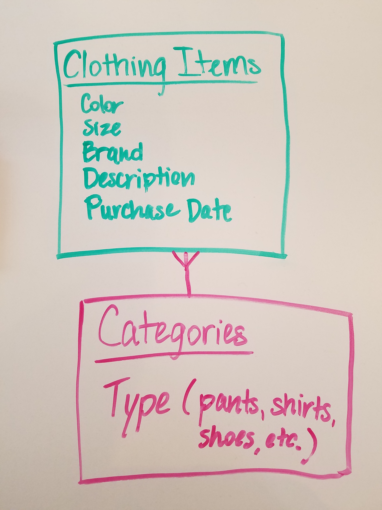

#Project 2
##"My Closet"
###For this project, I decided to create an app that shows a list of clothing items in a person's closet. The user can scroll through the list or perform a search to retrieve information about a particular item. 
# 
###I will focus on the "Jackets" clothing item for this project.
####Below is the user story for the app.
#  
####Below is the Entity Relationship Diagram (ERD).
# 
####The Clothing Items table will consist of the following attributes:
####ID - int
####Color - String
####Size - String
####Brand - String
####Description - String
####Purchase Date - String

####My stretch goal is to have another table of Categories that would include the different types of clothing items in a closet (i.e. shirts, pants, shoes)to continue the same ideas with each of those categories.